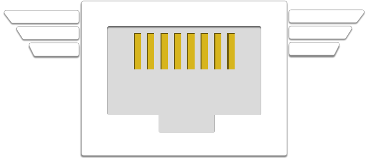

# Mercury: network fingerprinting and packet metadata capture
 

This package contains two programs for fingerprinting network traffic and capturing and analyzing packet metadata: **mercury**, a Linux application that leverages the modern Linux kernel's high-performance networking capabilities (AF_PACKET and TPACKETv3), which is described below, and [**pmercury**](python/README.md), a portable python application, which is described [here](python/README.md).

## Building, installing, and running mercury
In the root directory, run 
```
./configure 
make
```
to build the package (and check for the required pip3 modules, dpkt ujson numpy pyasn hpack pypcap).  If you do not have **python3**, **cython**, and **pip3** installed, then you either need to install them (using apt, yum, or whatever your preferred package management tool is), or you need to run 
```
./configure --disable-python
make
```
With the **--disable-python** flag, the configure script can build mercury in a way that omits the fingerprint analysis module (which is implemented using cython and python3).  Without the analysis module, mercury can still perform fingerprint and metadata capture.  

### Installation
In the root directory, edit mercury.cfg with the network interface you want to capture from, then run 
```
./configure
make
sudo make install
```
to install mercury and create and start a systemd service.  If you don't want the mercury systemd service to be installed, then instead run
```
sudo make install-nosystemd
```
The default file and directory locations are
   * __/usr/local/bin/mercury__ for the executable
   * __/usr/local/share/mercury__ for the resource files
   * __/usr/local/var/mercury__ for the output files
   * __/etc/mercury/mercury.cfg__ for the configuration file
   * __/etc/systemd/system/mercury.service__ for the systemd unit file

The output file directory is owned by the user **mercury**; this user is created by the 'make install' target, which must be run as root.  The installation prefix **/usr/local/** can be changed by running ./configure with the --prefix argument, for instance `--prefix=$HOME'.  If you want to install the program somewhere in your home directory, you probably don't want to create the user mercury; you should use the 'make install-nonroot' target, which does not create a user, does not install anything into /etc, and does not install a systemd unit.

The easiest way to run mercury in capture mode is using systemd; the OS automatically starts the mercury systemd unit after each boot, and halts it when the OS is shut down.  To check its status, run
```
systemctl status mercury
```
and the output should contain 'active (running)'.  To view the log (stderr) output from the mercury unit, run
```
sudo journalctl -u mercury
```


#### Compile-time options
There are compile-time options that can tune mercury for your hardware, or generate debugging output.  Each of these options is set via a C/C++ preprocessor directive, which should be passed as an argument to "make".   For instance, to turn on debugging, first run **make clean** to remove the previous build, then run **make "OPTFLAGS=-DDEBUG"**.   This runs make, telling it to pass the string "-DDEBUG" to the C/C++ compiler.  The available compile time options are:
   * -DDEBUG, which turns on debugging, and
   * -FBUFSIZE=16384, which sets the fwrite/fread buffer to 16,384 bytes (for instance).
If multiple compile time options are used, then they must be passed to make together in the OPTFLAGS string, e.g. "OPTFLAGS=-DDEBUG -DFBUFSIZE=16384".

### Running mercury
```
mercury: packet metadata capture and analysis
./src/mercury INPUT [OUTPUT] [OPTIONS]:
INPUT
   [-c or --capture] capture_interface   # capture packets from interface
   [-r or --read] read_file              # read packets from file
OUTPUT
   [-f or --fingerprint] json_file_name  # write fingerprints to JSON file
   [-w or --write] pcap_file_name        # write packets to PCAP/MCAP file
   no output option                      # write JSON packet summary to stdout
--capture OPTIONS
   [-b or --buffer] b                    # set RX_RING size to (b * PHYS_MEM)
   [-t or --threads] [num_threads | cpu] # set number of threads
   [-u or --user] u                      # set UID and GID to those of user u
   [-d or --directory] d                 # set working directory to d
--read OPTIONS
   [-m or --multiple] count              # loop over read_file count >= 1 times
GENERAL OPTIONS
   [-a or --analysis]                    # analyze fingerprints
   [-s or --select]                      # select only packets with metadata
   [-l or --limit] l                     # rotate JSON files after l records
   [-v or --verbose]                     # additional information sent to stdout
   [-p or --loop] loop_count             # loop count >= 1 for the read_file
   [-h or --help]                        # extended help, with examples
```

### Details

   **[-c or --capture] c** captures packets from interface c with Linux AF_PACKET
   using a separate ring buffer for each worker thread.  **[-t or --thread] t**
   sets the number of worker threads to t, if t is a positive integer; if t is
   "cpu", then the number of threads will be set to the number of available
   processors.  **[-b or --buffer] b** sets the total size of all ring buffers to
   (b * PHYS_MEM) where b is a decimal number between 0.0 and 1.0 and PHYS_MEM
   is the available memory; USE b < 0.1 EXCEPT WHEN THERE ARE GIGABYTES OF SPARE
   RAM to avoid OS failure due to memory starvation.  When multiple threads are
   configured, the output is a *file set*: a directory into which each thread
   writes its own file; all packets in a flow are written to the same file.

   **[-f or --fingerprint] f** writes a JSON record for each fingerprint observed,
   which incorporates the flow key and the time of observation, into the file or
   file set f.  With **[-a or --analysis]**, fingerprints and destinations are
   analyzed and the results are included in the JSON output.  The analysis output
   is documented [in the pmercury README](python/README.md).

   **[-w or --write] w** writes packets to the file or file set w, in PCAP format.
   With **[-s or --select]**, packets are filtered so that only ones with
   fingerprint metadata are written.

   **[r or --read] r** reads packets from the file or file set r, in PCAP format.
   A single worker thread is used to process each input file; if r is a file set
   then the output will be a file set as well.  With **[-m or --multiple] m**, the
   input file or file set is read and processed m times in sequence; this is
   useful for testing.

   **[-u or --user] u** sets the UID and GID to those of user u; output file(s)
   are owned by this user.  With **[-l or --limit] l**, each JSON output file has
   at most l records; output files are rotated, and filenames include a sequence
   number.

   **[-h or --help]** writes this extended help message to stdout.

### Examples
```bash
   mercury -c eth0 -w foo.pcap           # capture from eth0, write to foo.pcap
   mercury -c eth0 -w foo.pcap -t cpu    # as above, with one thread per CPU
   mercury -c eth0 -w foo.mcap -t cpu -s # as above, selecting packet metadata
   mercury -r foo.mcap -f foo.json       # read foo.mcap, write fingerprints
   mercury -r foo.mcap -f foo.json -a    # as above, with fingerprint analysis
   mercury -c eth0 -t cpu -f foo.json -a # capture and analyze fingerprints
```

## Ethics
Mercury is intended for defensive network monitoring and security research and forensics.  Researchers, administrators, penetration testers, and security operations teams can use these tools to protect networks, detect vulnerabilities, and benefit the broader community through improved awareness and defensive posture. As with any packet monitoring tool, Mercury could potentially be misused. **Do not run it on any network of which you are not the owner or the administrator**.

## Credits
Mercury was developed by David McGrew, Brandon Enright, Blake Anderson, Shekhar Acharya, and Adam Weller, with input from Brian Long, Bill Hudson, and others.  Pmercury was developed by Blake Anderson, with input from the others.  

## Acknowledgments
This software includes GeoLite2 data created by MaxMind, available from [https://www.maxmind.com](https://www.maxmind.com).

We make use of Mozilla's [Public Suffix List](https://publicsuffix.org/list/) which is subject to the terms of the [Mozilla Public License, v. 2.0](https://mozilla.org/MPL/2.0/).
